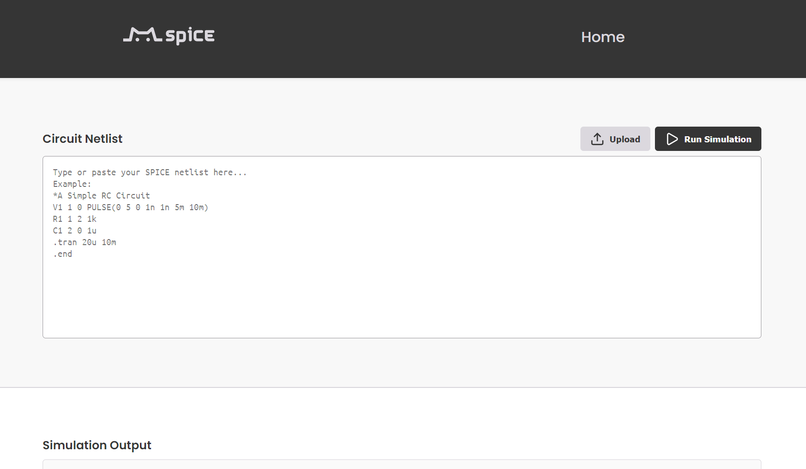

# Mspice - Python-Based SPICE Circuit Simulation

    [](http://mspice.pythonanywhere.com)


**Mspice** is a lightweight, web-based circuit simulation tool designed for students and researchers. Built with a Python kernel, it interprets standard SPICE netlists (.sp/.txt) and performs precise circuit analysis without the complexity of traditional industrial tools.

We have deployed Mspice on PythonAnywhere. You can try the live demo here: [http://mspice.pythonanywhere.com](http://mspice.pythonanywhere.com)


## 🚀 Features

*   **Zero Installation**: Run simulations directly from your web browser.
*   **Standard Netlist Support**: Compatible with SPICE formats for Resistors, Capacitors, Inductors, MOSFETs, and Voltage Sources.
*   **Multiple Analysis Modes**:
    *   **Transient Analysis (`.tran`)**: Visualize voltage over time.
    *   **AC Analysis (`.ac`)**: Frequency response sweeps.
    *   **DC Sweep (`.dc`)**: Voltage transfer characteristics.
*   **Interactive Visualization**: Powered by **Plotly.js**, offering zoom, hover-to-inspect, and signal toggle capabilities.
*   **Modern UI**: A clean, responsive interface with Dark Mode aesthetics.
*   **Concurrent Simulation**: Unique session handling ensures multiple users can simulate simultaneously without conflict.

## 📸 Application Interface

The simulation environment provides a split-view for code entry and real-time interactive results.



## 🛠️ Getting Started

### Prerequisites
*   Python 3.10+
*   pip

### Installation

1.  **Clone the repository**
    ```bash
    git clone https://github.com/William08290829/Mspice.git
    cd mspice
    ```

2.  **Install Dependencies**
    ```bash
    pip install -r requirements.txt
    ```

3.  **Run the Server**
    ```bash
    python app.py
    ```

4.  **Access the App**
    Open your browser and navigate to `http://localhost:5000`.

## 📖 Usage Guide

1.  **Prepare your Netlist**: Create a text file describing your circuit (e.g., `*.sp` or `*.txt`).
    *   *Example Netlist (RC Circuit)*:
        ```spice
        * Simple RC Circuit
        V1 1 0 PULSE(0 5 0 1n 1n 5m 10m)
        R1 1 2 1k
        C1 2 0 1u
        .tran 20u 10m
        .end
        ```
2.  **Upload or Paste**: Use the **Upload** button or paste the text directly into the editor on the App page.
3.  **Run Simulation**: Click **Run Simulation**.
4.  **Analyze Results**:
    *   View the interactive plot.
    *   Use the **Select Signals** dropdown to filter waveforms.
    *   Download the plot as a PNG or export raw data as CSV.

## 👥 Project Team

**Mspice** was developed as a graduation project at **National Central University (NCU), Department of Electrical Engineering**.

*   Shiuan-Yi Lee - *Core Algorithm*
*   Sheng-Lun Huang - *Core Algorithm*
*   Chi-Chun Huang - *Core Algorithm*
*   Chun-Wei Chen - *Core Algorithm, Full Stack Development & UI/UX*

**Advisor**: Prof. Chiou-Chih Chou

---
*© 2025 Mspice Team. All Rights Reserved.*
